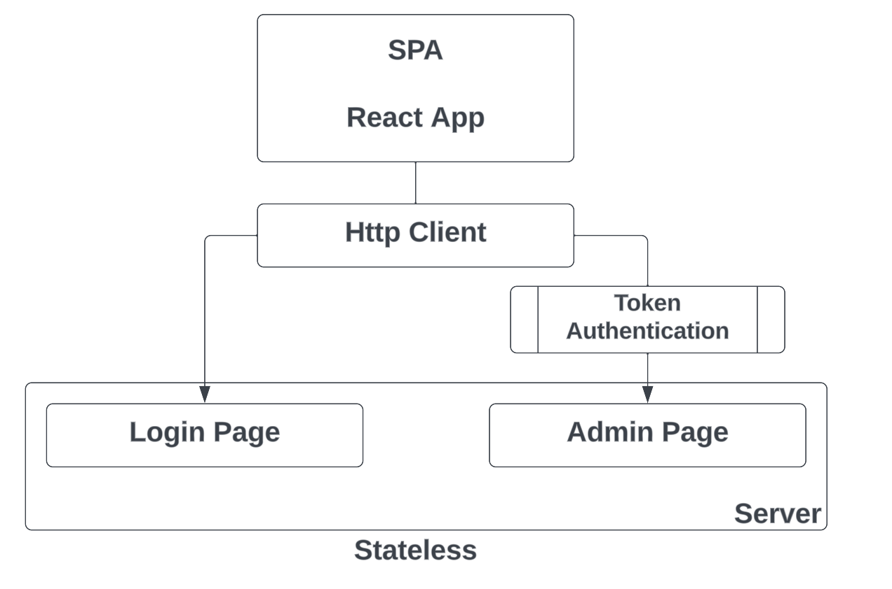
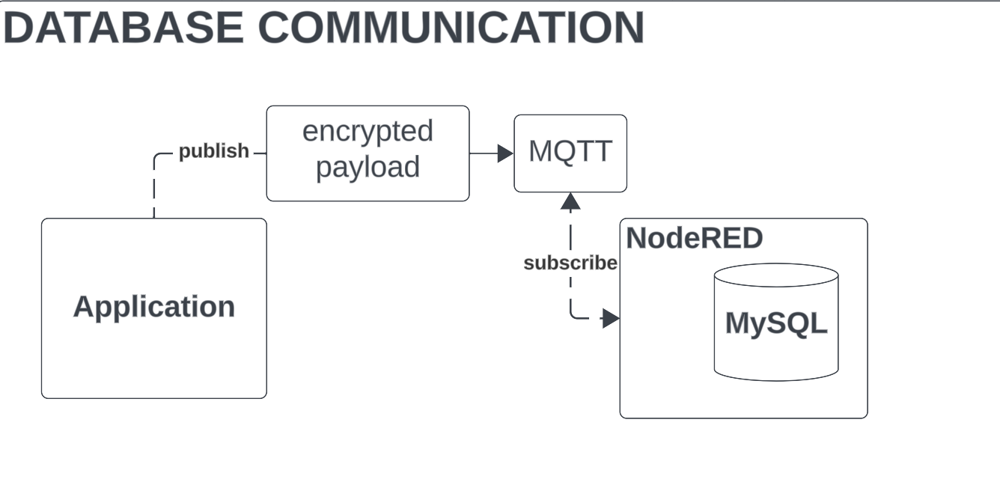
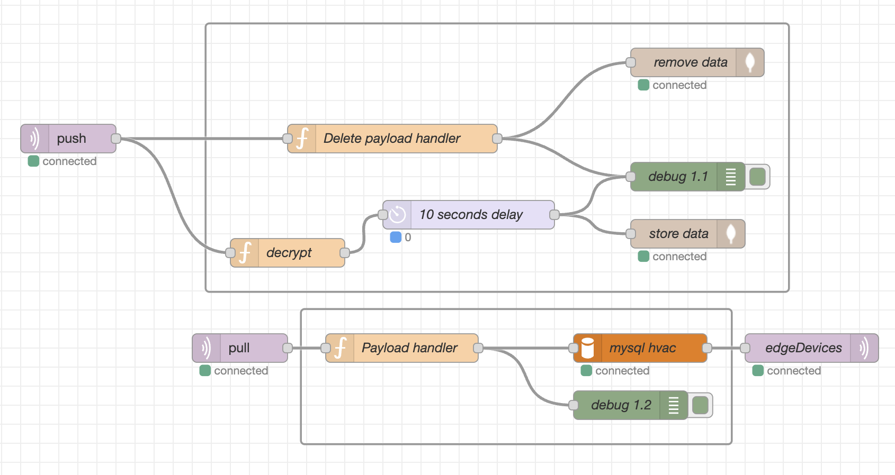

# ac-bldg-scheduler

Hi team,Please refer to this board for the documentation of our project plan and design for Capstone 2.

- [Project Plan](https://docs.google.com/document/d/1XnWrhZ1bIinzcsbrz47A5ZVFCcqJuurA/edit?usp=sharing&ouid=115706149544180113982&rtpof=true&sd=true)
- [Design Figma prototype](https://www.figma.com/proto/Vw6dqVHkMgYLZHV0hYrxIv/Airconnect-Automated-Holiday-Schedule-Web-App?node-id=78-10&starting-point-node-id=78%3A10&mode=design&t=6J8SUCdzGcdbFgdG-1)
- [Version 2 Prototype](https://www.figma.com/proto/ogxWH9iXiOSwCzgBKocTBo/Airconnect-Automated-Holiday-Schedule-Web-App-(version-2)?node-id=78-10&starting-point-node-id=78%3A10)

## Node Version
install v18.12.1 node version

## Application

## MQTT Communication

## NodeRED

